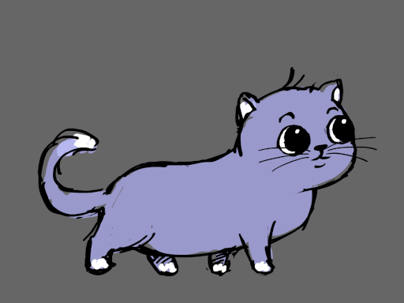
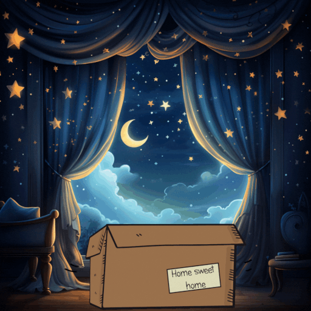
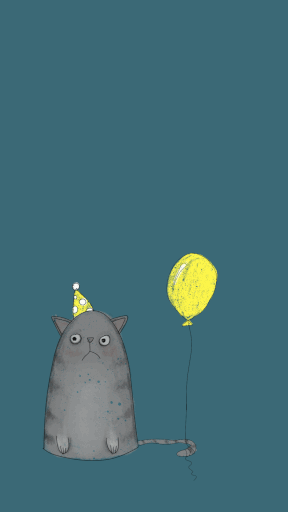

<!-- ============================================ -->
<!-- セクション0: ヘッダー                        -->
<!-- ============================================ -->
<div align="center">


<br>



</div>

<!-- ============================================ -->
<!-- セクション1: 自己紹介                        -->
<!-- ============================================ -->
<div align="center">

<br>


<br>


<br>



</div>

<!-- ============================================ -->
<!-- セクション2: ステータスダッシュボード         -->
<!-- ============================================ -->

<div align="center">

```
$ cat ~/.status --verbose
```

<table>
<tr>
<td width="55%" valign="top">

```
現在の状態:
├── コーヒー ........ 3杯目（たぶん冷めてる）
├── 猫 .............. 膝の上（重い、どかない）
├── 時刻 ............ 深夜（いつも）
├── BGM ............. Lo-fi Hip Hop
├── ブラウザタブ .... 47個（閉じる勇気がない）
├── TODO ............ 増殖中（自己複製疑惑）
└── コード .......... なんか動いてる（理由は不明）
```

</td>
<td width="45%" valign="top" align="center">

<br>


<br><br>

<sub>「あと5分で寝る」（3時間前のログ）</sub>

</td>
</tr>
</table>

</div>

<!-- ============================================ -->
<!-- セクション3: プロジェクト / 興味              -->
<!-- ============================================ -->

<div align="center">

```
$ ls -la ./projects/ && cat ./interests.md
```

<table>
<tr>
<td width="50%" valign="top">

### > ./projects/

```diff
+ AIと一緒にコードを書く実験
+ 個人プロダクトをいくつか同時進行
+ UIの気持ちよさを追求する日々
! 猫がEnterキーを押してデプロイされた
! git push -f を猫のせいにした（本当）
- 睡眠時間（削除済み）
```

</td>
<td width="50%" valign="top">

### > ./interests.md

```
AI駆動開発 ............... [####------]
クリエイティブコーディング . [######----]
自動化（怠惰は美徳） ..... [########--]
UI/UXデザイン ............ [#####-----]
深夜のひらめき ........... [##########]
猫プログラミング ......... [??????????]
```

</td>
</tr>
</table>

</div>

<!-- ============================================ -->
<!-- セクション4: 技術スタック                    -->
<!-- ============================================ -->

<div align="center">

```
$ ls ./toolbox/ -la --color=always
```

<br>


<br><br>

  

<br>


</div>

<!-- ============================================ -->
<!-- セクション5: GitHub Stats フルセット          -->
<!-- ============================================ -->

<div align="center">

```
$ git log --oneline --graph --all --decorate | head -∞
```

<br>

<a href="https://github.com/funatoyouhei">
  <picture>
    <source media="(prefers-color-scheme: dark)" srcset="https://github-readme-stats.vercel.app/api?username=funatoyouhei&show_icons=true&theme=github_dark&hide_border=true&bg_color=0d1117&title_color=c9d1d9&text_color=8b949e&icon_color=58a6ff&ring_color=58a6ff" />
    
  </picture>
</a>
<a href="https://github.com/funatoyouhei">
  <picture>
    <source media="(prefers-color-scheme: dark)" srcset="https://github-readme-stats.vercel.app/api/top-langs/?username=funatoyouhei&layout=compact&theme=github_dark&hide_border=true&bg_color=0d1117&title_color=c9d1d9&text_color=8b949e" />
    
  </picture>
</a>

<br>

<a href="https://github.com/funatoyouhei">
  <picture>
    <source media="(prefers-color-scheme: dark)" srcset="https://github-readme-streak-stats.herokuapp.com?user=funatoyouhei&theme=dark&hide_border=true&background=0d1117&ring=58a6ff&fire=58a6ff&currStreakLabel=c9d1d9&sideLabels=8b949e&sideNums=c9d1d9&currStreakNum=c9d1d9&dates=8b949e" />
    
  </picture>
</a>

<br>

<a href="https://github.com/funatoyouhei">
  
</a>

<br><br>

<picture>
  <source media="(prefers-color-scheme: dark)" srcset="https://github-readme-activity-graph.vercel.app/graph?username=funatoyouhei&theme=github-compact&hide_border=true&bg_color=0d1117&color=8b949e&line=58a6ff&point=c9d1d9&area=true&area_color=1a1e2e" />
  
</picture>

</div>

<!-- ============================================ -->
<!-- セクション6: Snake Animation                  -->
<!-- ============================================ -->

<div align="center">

```
$ python3 snake.py --feed-on-contributions
```

<br>

<picture>
  <source media="(prefers-color-scheme: dark)" srcset="https://raw.githubusercontent.com/funatoyouhei/funatoyouhei/output/github-snake-dark.svg" />
  <source media="(prefers-color-scheme: light)" srcset="https://raw.githubusercontent.com/funatoyouhei/funatoyouhei/output/github-snake.svg" />
  
</picture>

</div>

<!-- ============================================ -->
<!-- セクション7: リンク + Buy Me a Coffee        -->
<!-- ============================================ -->

<div align="center">

```
$ echo $LINKS
```

<br>

<a href="https://portfolio-713.pages.dev/">
  
</a>

<br><br>

<details>
<summary><sub>もしよければ</sub></summary>
<br>



<br><br>

<a href="https://buymeacoffee.com/funatoyouhei">
  
</a>

<br>

<sub>深夜のコーヒー代になります。猫のおやつかも。</sub>
</details>

</div>

<!-- ============================================ -->
<!-- セクション8: フッター                        -->
<!-- ============================================ -->

<div align="center">

<br>


</div>
